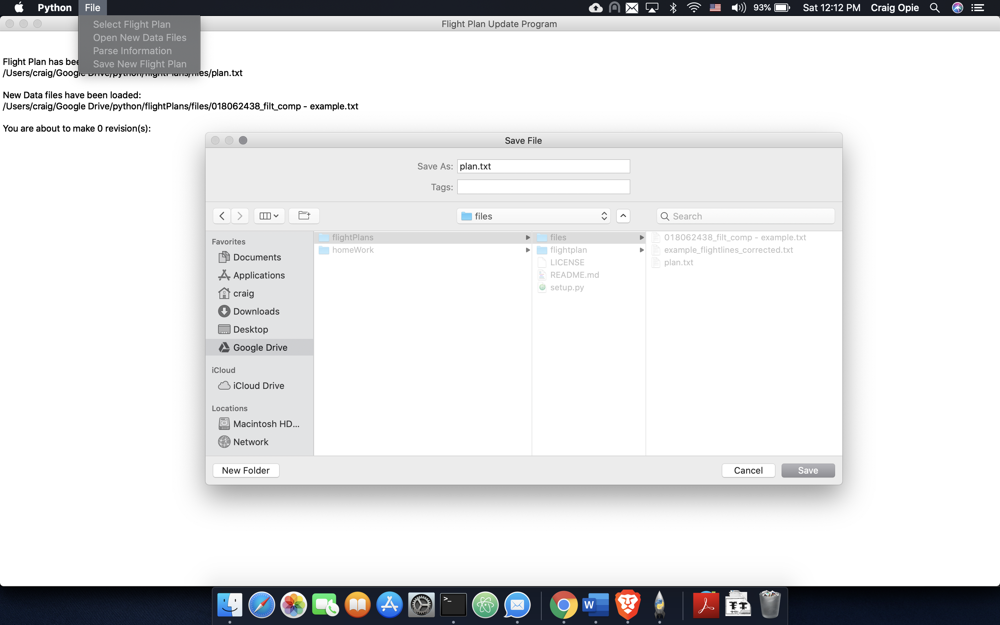

Flight Plan is a freelance project that was solicitated via reddit.  A worker at the Sydney Airport was responsible for manually reviewing revisions to flight plans and updating the master flight plan file.  If the revisions were not properly implemented into the master flight plan file, the airline would incurr delayed departures and/or pilots would not be able to utilize the autopilot features of the plane.  The worker was not familiar with command line functions and was working with a Windows OS.  

For this project, I had to interview the worker to discover his current process for handling flight plan revisions, what the minimum functionality of the application needed to be, and what his desires were for the application.  This project required me to do research on the airline's systems to become comfortable with identifying the required changes to the master file. The worker specifically requested Python as the development language. 

After gathering all information I sketched out a "software map" identifying the processes required to accomplish the task.  This allowed me to evaluate the most streamlined methods of memory access and determining where hash maps should be used to speed up data integration.  Once the functionality plan was established to meet the minimum requirements, I designed the GUI to provide working information to the user while allowing "minimal click" interactions to complete the required tasks.  After coordinating demonstration evaluations with the worker, I packaged the application using py2exe so the software would work regardless of the system's Python version/updates. 

The worker was very pleased with the final product which saves the worker approximately one hour of manual labor each day, improves the reliability of the flight plan revision process, and improves the airline's reliability and scheduling.

Source: <a href="https://github.com/CraigOpie/flightplan"><i class="large github icon"></i>CraigOpie/flightplan</a>

